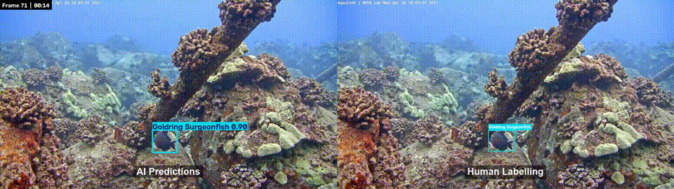
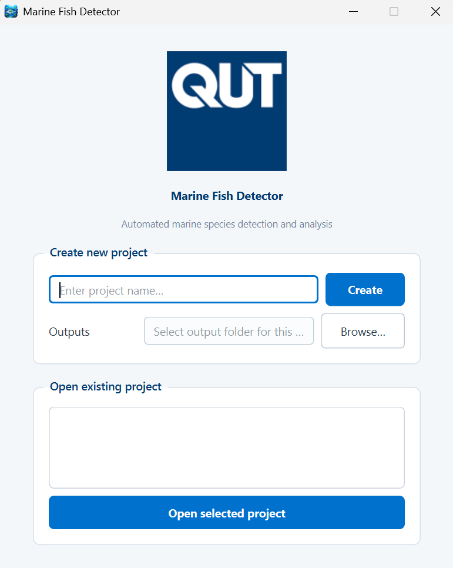
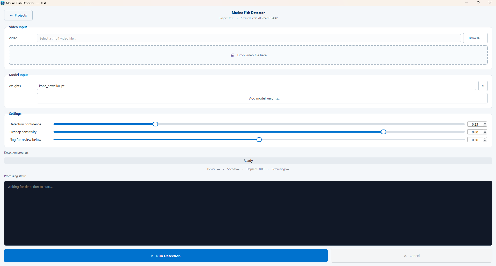
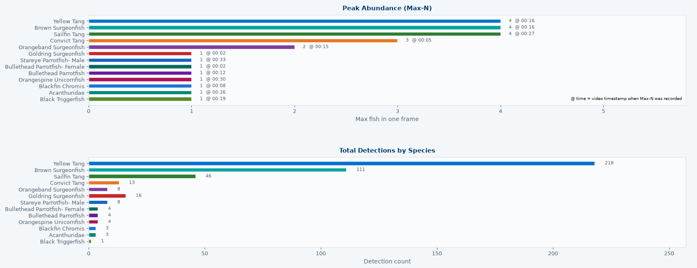

# 🐟 Marine Fish Detection and Classification GUI

A desktop application for automated marine fish detection, classification, tracking, and analysis from underwater video.


---

## Overview 

The Marine Fish Detection and Classification GUI provides an accessible graphical interface for processing underwater video using AI-driven fish detection and classification.

The application lets researchers and marine scientists use AI tools to accelerate underwater marine analysis without requiring programming experience.

Below is an example of AI-annotated underwater imagery positioned next to the ground truth, labelled by a human.

<p align="center">

</p>

### Features

- Automated fish detection and species classification
- Multi-object tracking
- Max-N abundance estimation by species
- Annotated video output
- Species-level detection summaries
- Low-confidence detection review
- Detection summary histograms and charts
- CSV result exports
- Project-based organisation of detection runs
- Support for additional compatible YOLO model weights (future support for additional AI models)

---

## Quick Start
> **Requirements:** Windows or Linux (Ubuntu 24.04), and approximately **5 GB of free disk space**.

### 1. Install Git and Pixi

**Windows USERS** — open **PowerShell** (`Win` → type `PowerShell` → Enter):
```powershell
winget install --id Git.Git -e --source winget
powershell -ExecutionPolicy ByPass -c "irm -useb https://pixi.sh/install.ps1 | iex"
```

**Linux USERS** — open **Terminal** (`Ctrl+Alt+T`):
```bash
sudo apt update && sudo apt install -y git git-lfs
curl -fsSL https://pixi.sh/install.sh | bash
```

**macOS USERS** — open **Terminal** (`Cmd+Space`, type "Terminal"):
```bash
# Install Homebrew if you don't have it
if ! command -v brew &> /dev/null; then
  /bin/bash -c "$(curl -fsSL https://raw.githubusercontent.com/Homebrew/install/HEAD/install.sh)"
fi

brew update && brew install git git-lfs
curl -fsSL https://pixi.sh/install.sh | bash
```

When installation finishes, **close and reopen** PowerShell/Terminal.

### 2. Install the Application and Create a Desktop Shortcut

**Windows USERS** (PowerShell):
```powershell
if (Test-Path "$HOME\OneDrive\Desktop") {
    $DesktopDir = "$HOME\OneDrive\Desktop"
} else {
    $DesktopDir = "$HOME\Desktop"
}
cd $DesktopDir
git lfs install
git clone https://github.com/Brad420169/Marine-Fish-Detection-and-Classification-GUI.git
cd Marine-Fish-Detection-and-Classification-GUI
git lfs pull
pixi install

$ProjectDir = (Get-Location).Path
$WshShell = New-Object -ComObject WScript.Shell
$Shortcut = $WshShell.CreateShortcut("$ProjectDir\..\Marine Fish Detection GUI.lnk")
$Shortcut.TargetPath = "$ProjectDir\launch_gui.bat"
$Shortcut.WorkingDirectory = $ProjectDir
$Shortcut.IconLocation = "$ProjectDir\assets\icon.ico"
$Shortcut.Save()
```

**Linux USERS** (Terminal):
```bash
cd ~/Desktop
git lfs install
git clone https://github.com/Brad420169/Marine-Fish-Detection-and-Classification-GUI.git
cd Marine-Fish-Detection-and-Classification-GUI
git lfs pull# Prerequisites (if not already installed):
# brew install git git-lfs
# curl -fsSL https://pixi.sh/install.sh | sh

pixi install
chmod +x launch_gui.sh

PROJECT_DIR="$(pwd)"
ICON_PNG="$PROJECT_DIR/assets/icon.png"

DESKTOP_FILE="$HOME/.local/share/applications/marine-fish-gui.desktop"
cat > "$DESKTOP_FILE" << EOF
[Desktop Entry]
Type=Application
Name=Marine Fish Detection GUI
Comment=Launch the Marine Fish Detection and Classification GUI
Exec=bash -c "cd '$PROJECT_DIR' && ./launch_gui.sh"
Icon=$ICON_PNG
Terminal=true
Categories=Utility;
EOF

chmod +x "$DESKTOP_FILE"
cp "$DESKTOP_FILE" "$HOME/Desktop/"
chmod +x "$HOME/Desktop/marine-fish-gui.desktop"
gio set "$HOME/Desktop/marine-fish-gui.desktop" metadata::trusted true 2>/dev/null || true

gtk-update-icon-cache "$HOME/.local/share/icons" 2>/dev/null
nautilus -q
```
**MAC USERS** (Terminal):

```bash
cd ~/Desktop
git lfs install
git clone https://github.com/Brad420169/Marine-Fish-Detection-and-Classification-GUI.git
cd Marine-Fish-Detection-and-Classification-GUI
git lfs pull
pixi install
chmod +x launch_gui.sh

PROJECT_DIR="$(pwd)"
APP_NAME="Marine Fish Detection GUI"
APP_DIR="$HOME/Desktop/${APP_NAME}.app"
ICON_PNG="$PROJECT_DIR/assets/icon.png"

mkdir -p "$APP_DIR/Contents/MacOS" "$APP_DIR/Contents/Resources"

cat > "$APP_DIR/Contents/MacOS/launch" << EOF
#!/bin/bash
osascript -e 'tell application "Terminal" to do script "cd \\"$PROJECT_DIR\\" && ./launch_gui.sh"'
EOF
chmod +x "$APP_DIR/Contents/MacOS/launch"

cat > "$APP_DIR/Contents/Info.plist" << EOF
<?xml version="1.0" encoding="UTF-8"?>
<!DOCTYPE plist PUBLIC "-//Apple//DTD PLIST 1.0//EN" "http://www.apple.com/DTDs/PropertyList-1.0.dtd">
<plist version="1.0">
<dict>
    <key>CFBundleExecutable</key><string>launch</string>
    <key>CFBundleIconFile</key><string>icon.icns</string>
    <key>CFBundleIdentifier</key><string>com.brad.marinefishgui</string>
    <key>CFBundleName</key><string>${APP_NAME}</string>
    <key>CFBundlePackageType</key><string>APPL</string>
</dict>
</plist>
EOF

mkdir -p /tmp/icon.iconset
for sz in 16 32 128 256 512; do
  sips -z $sz $sz "$ICON_PNG" --out /tmp/icon.iconset/icon_${sz}x${sz}.png
  sips -z $((sz*2)) $((sz*2)) "$ICON_PNG" --out /tmp/icon.iconset/icon_${sz}x${sz}@2x.png
done
iconutil -c icns /tmp/icon.iconset -o "$APP_DIR/Contents/Resources/icon.icns"
rm -rf /tmp/icon.iconset

touch "$APP_DIR"
killall Finder
```

> **First launch:** macOS Gatekeeper may block the unsigned app — right-click the app on your Desktop and choose **Open** once, or run:
> ```bash
> xattr -cr "$HOME/Desktop/Marine Fish Detection GUI.app"
> ```
> 
You'll see a new icon called **"Marine Fish Detection GUI"** on your Desktop.

### 3. Launch

Double-click the **Marine Fish Detection GUI** icon on your Desktop.

- **Windows:** launches immediately.
- **Linux:** the first time, you may be asked if you trust the shortcut — click **"Trust and Launch"**. If double-clicking does nothing, right-click the icon and choose **"Allow Launching"**, then try again.

That's it — every future launch is just this same double-click.

## Using the Application

### 1. Create a Project


When the application opens:

1. Enter a project name.
2. Select where you want detection results to be stored.
3. Click **Create**.

<p align="left">

</p>

Your detection runs will be organised under this project.

### 2. Select a Video

Select a video using the **Video Input** section or drag and drop a video directly into the application.

### 3. Select a Model

Choose a marine fish detection model from the **Model Input** section.

The application includes default detection models.

Additional YOLO `.pt` model weights can be added using **Add model weights**.

### 4. Configure Detection Settings

The following parameters can be adjusted before running detection:

| Setting | Description |
|---|---|
| **Detection confidence** | Minimum confidence required for a detection to be accepted |
| **Overlap sensitivity** | Controls how overlapping detection boxes are handled (Higher values can capture closely bundled fish more accurately, at the cost of occasional double/triple detections)|
| **Flag for review below** | Accepted detections below this confidence are flagged for manual review |

Change values using either the slider or the numeric field.

Hover over a parameter name in the application for additional information.

The default values provide a reasonable starting point.

### 5. Run Detection

Click **▶ Run Detection**.

While the video is being processed, the application displays:

- Detection progress
- Frames processed
- Processing speed
- Elapsed time
- Estimated time remaining
- Processing device

The **Results** page opens automatically when processing is complete.

<p align="center">

</p>

---

## Results

The Results page provides a summary of the completed detection run and access to its generated outputs.

### Annotated Video

The annotated video contains detected fish with:

- Bounding boxes
- Species classifications
- Confidence scores
- Frame numbers
- Video timestamps

The video can be opened directly from the Results page.

### Detection Summary

The application generates:

**`track_summary.csv`**

This contains species-level information including:

- Species
- Max-N
- Max-N timestamp
- First and last observation
- Visible duration
- Unique tracks (generated by AI tracker BotSort)
- Total detections
- Mean detection confidence

### Low-Confidence Review

The application generates:

**`low_confidence_review.csv`**

This contains accepted detections below the selected review threshold so uncertain detections can be identified for manual inspection.

### Max-N Example Frames

Example frames are saved for reported Max-N observations, with the relevant detections highlighted.

These can be used to visually inspect the fish contributing to the Max-N estimate.

### Summary Charts

The Results page includes charts showing:

- Peak abundance (Max-N)
- Total detections
- Visible duration
- Mean detection confidence

<p align="center">

</p>

Results can also be exported as a summary figure.

### Past Runs

You can reopen previous detection runs from the **Past Runs** section without reprocessing the video.

---

## Updating

To update the application, open PowerShell in the application folder and run:

```powershell
git pull
git lfs pull
pixi install
```

Then launch normally using:

**`launch_gui.bat`**

Or the Linux desktop shortcut

---

## Troubleshooting

 
### `git` is not recognised / not found
**Windows & Linux** Close and reopen the terminal. If the problem continues, confirm it is installed with `git --version`.
 
### `pixi` is not recognised / not found
Close and reopen PowerShell/Terminal, then check:
```
pixi --version
```
**Linux:** if it still isn't found, `pixi` may not be on your `PATH` for non-login shells. Run `which pixi` to find its location, then use that full path when running `pixi` commands (or add it to `~/.bashrc`).
 
### Model files did not download
Open PowerShell/Terminal in the application folder and run:
```
git lfs install
git lfs pull
```
 
### The application does not launch
Open PowerShell/Terminal in the application folder and run:
```
pixi install
pixi run GUI
```
Any startup errors will then be displayed in the terminal.
 
**Linux only:** if double-clicking the Desktop shortcut does nothing but running `./launch_gui.sh` from a terminal works, this is a known Linux desktop-file quirk, not a bug in the app. Right-click the shortcut → **Allow Launching**, and make sure it's marked executable:
```bash
chmod +x ~/Desktop/marine-fish-gui.desktop
```

### Detection is slow

Processing speed depends heavily on the available hardware.

A compatible GPU can significantly improve detection performance. Systems without a compatible GPU can use CPU processing, but processing will generally be slower.

---

## Project Structure

```text
Marine-Fish-Detection-and-Classification-GUI/
│
├── assets/             Application icons and graphics
├── models/             Marine fish detection model weights
├── scripts/            Application source code
│
├── launch_gui.bat      Windows launcher
├── pixi.toml           Environment configuration
├── pixi.lock           Locked dependency environment
├── .gitattributes      Git LFS configuration
├── .gitignore          Local/generated file exclusions
├── LICENSE             Software license
└── README.md
```

Application environments and user-created project information are generated locally and are not stored in the repository.

Detection outputs are stored in the location selected by the user when creating a project.

---

## Development

The application is written in Python and uses:

- PyQt6
- Ultralytics YOLO
- PyTorch
- OpenCV
- Matplotlib
- NumPy

The development and runtime environment is managed using Pixi.

### Planned Features

Future development may include:

- Support for additional object detection architectures such as RF-DETR
- Expanded model management
- Improved detection review and correction tools
- Additional result visualisation and analysis options

---

## Adding a New Model Architecture (`scripts/detectors.py`)

All model-specific code lives in **one file**, `scripts/detectors.py`. The rest of
the application (`pipeline.py`, `worker.py`, the GUI) never imports a model
library directly — it only ever talks to the adapter interface defined here. This
is why adding RF-DETR support (when the app originally only ran YOLO) touched a
single file. Adding a third architecture works the same way.

### The contract: `DetectionFrame`

Every detector, no matter the underlying library, must turn one video frame into
one `DetectionFrame`:

| Field | Type | Meaning |
|---|---|---|
| `annotated` | `np.ndarray` (BGR) | The frame with boxes/labels already drawn, ready to write to the output video |
| `species` | `list[str]` | Class **name** per detection (not an integer id) |
| `confidences` | `list[float]` | Score per detection, `0.0`–`1.0` |
| `xyxy` | `list[list[float]]` | Pixel box `[x1, y1, x2, y2]` per detection |
| `track_ids` | `list[int \| None]` | Persistent track id per detection, or `None` if this model has no tracker |

All five lists are **parallel** — index `i` refers to the same detection in each.
Return an empty `DetectionFrame(annotated=frame)` when nothing is detected.

Downstream, `pipeline.py` uses `species` for Max-N counts, `track_ids` for the
unique-track count, `confidences` for the low-confidence review threshold, `xyxy`
to crop the Max-N example images, and `annotated` for the output video. If your
adapter fills these fields correctly, everything else "just works".

### The interface

```python
class BaseDetector:
    kind: str = "base"          # short label, e.g. "yolo" / "rfdetr"; used only for logging

    def infer(self, frame_bgr, conf: float, iou: float) -> DetectionFrame:
        raise NotImplementedError
```

- **`__init__`** loads the model **once** (weights, device, tracker, annotators).
- **`infer`** is called once per frame with the confidence and IoU thresholds
  from the GUI sliders. If your architecture has no IoU/NMS step (RF-DETR is
  NMS-free), just ignore the `iou` argument.

### The factory: `load_detector()`

```python
def load_detector(weights_path: Path, device: str | None) -> BaseDetector:
    suffix = weights_path.suffix.lower()
    if suffix == ".pt":
        return YOLODetector(weights_path, device=device)
    if suffix == ".pth":
        return RFDETRDetector(weights_path, device=device)
    raise ValueError(...)
```

The model type is chosen by **file extension**. To add an architecture you add a
branch here (and, if it uses a new extension, teach the GUI's *Add model weights*
dialog to accept it — see `WeightsRow` in `app.py`).

### The two worked examples already in the file

- **`YOLODetector`** — wraps Ultralytics `YOLO`. Tracking is built in, so it calls
  `model.track(frame, persist=True, tracker="botsort.yaml", conf=..., iou=...)`
  and reads `result.boxes` (`.cls`, `.conf`, `.xyxy`, `.id`), maps class ids to
  names via `result.names`, and uses `result.plot()` for the annotated frame.
- **`RFDETRDetector`** — RF-DETR has **no built-in tracker**, so the adapter
  attaches one itself: `supervision`'s `ByteTrack`, updated every frame with
  `tracker.update_with_detections(...)`. It converts BGR→RGB before `predict`,
  draws boxes with `supervision`'s `BoxAnnotator` / `LabelAnnotator`, resolves the
  device explicitly (a GPU-trained checkpoint can otherwise force `cuda` on a
  CPU-only machine), and falls back to placeholder class names if the checkpoint
  has none embedded.

### Checklist for a new architecture

1. **New class** `class MyDetector(BaseDetector)` with a `kind` string.
2. **`__init__`**: import the library *inside* the method (keeps it optional),
   load weights once, resolve the device explicitly rather than trusting whatever
   the checkpoint saved.
3. **Tracking**: if the model ships a tracker, use it; otherwise instantiate
   `sv.ByteTrack()` (or similar) and call it each frame. If you truly have no
   tracking, set `track_ids = [None] * len(species)` — Max-N still works, only the
   unique-track count is lost.
4. **`infer`**: run the model, handle the zero-detection case first, then build
   the five parallel lists and the annotated BGR frame, and return a
   `DetectionFrame`.
5. **Register** the weights extension in `load_detector()`.
6. **Dependencies**: add any new packages to `pixi.toml` (conda-forge under
   `[dependencies]`, otherwise `[pypi-dependencies]`) and run `pixi install`.

Nothing outside `detectors.py` should need to change.

---

## Model and Dataset Attribution

The included marine fish detection models were trained using the **Kona, Hawaii Dataset**, published by ReefOSHawaii on Roboflow Universe.

**Dataset citation:**

> ReefOSHawaii. (2022). *Kona, Hawaii Dataset*. Roboflow Universe.

[Kona, Hawaii Dataset — Roboflow Universe](https://universe.roboflow.com/reefoshawaii/kona-hawaii)

The dataset is licensed under the **Creative Commons Attribution 4.0 International (CC BY 4.0) License**.

[Creative Commons Attribution 4.0 International](https://creativecommons.org/licenses/by/4.0/)

The model weights included in this repository were trained by the author of this project using the Kona, Hawaii Dataset. They are not original model weights supplied by ReefOSHawaii or Roboflow.

---

## License

The application source code is licensed under the **MIT License**. See [`LICENSE`](LICENSE) for details.

The included model weights were trained using the Kona, Hawaii Dataset described above. The underlying training dataset is provided by ReefOSHawaii under the **Creative Commons Attribution 4.0 International (CC BY 4.0) License**.
