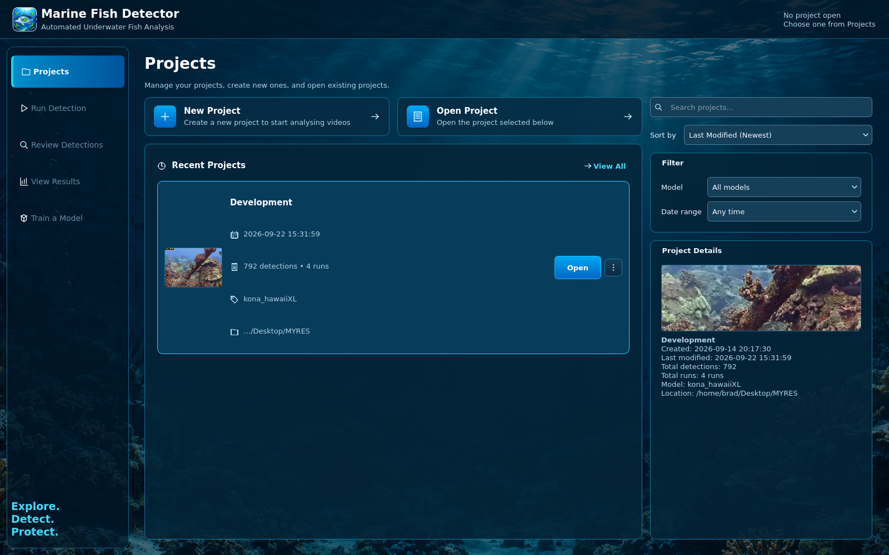
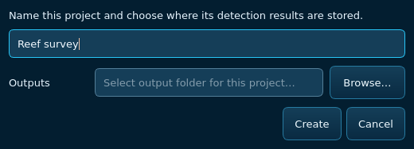
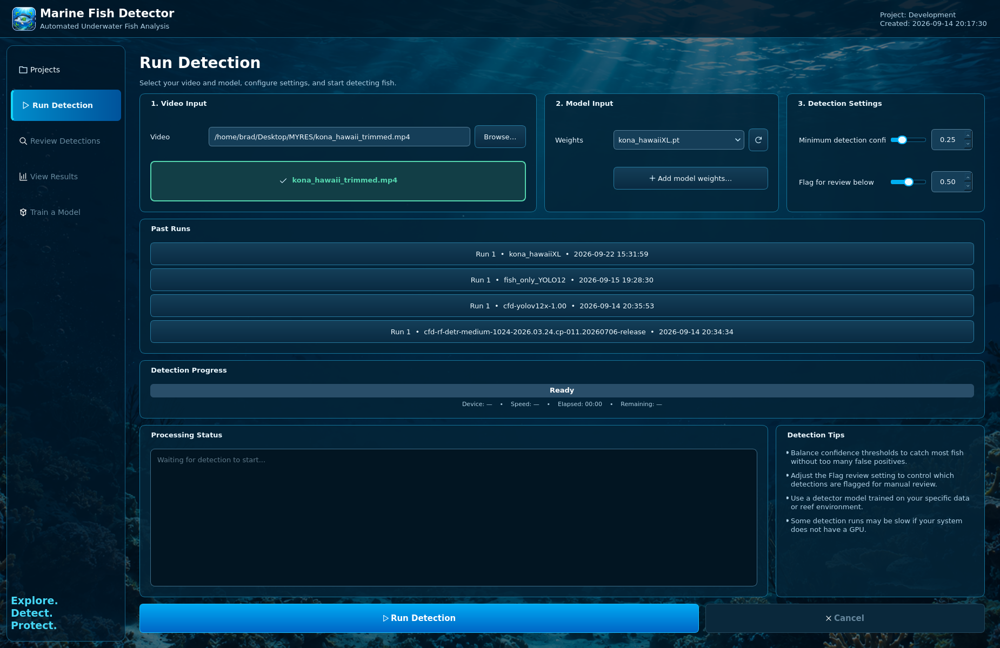
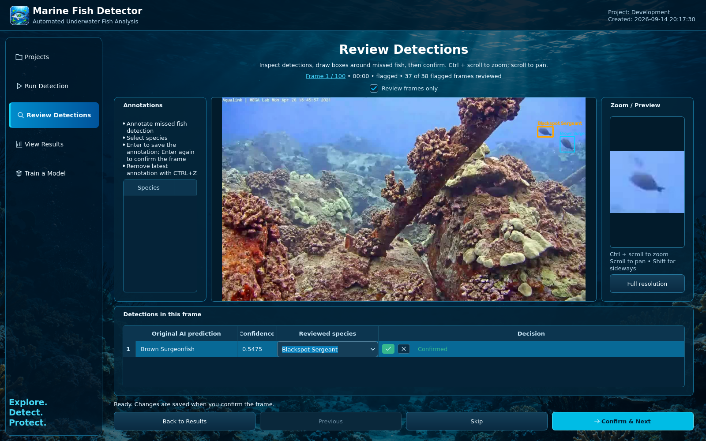
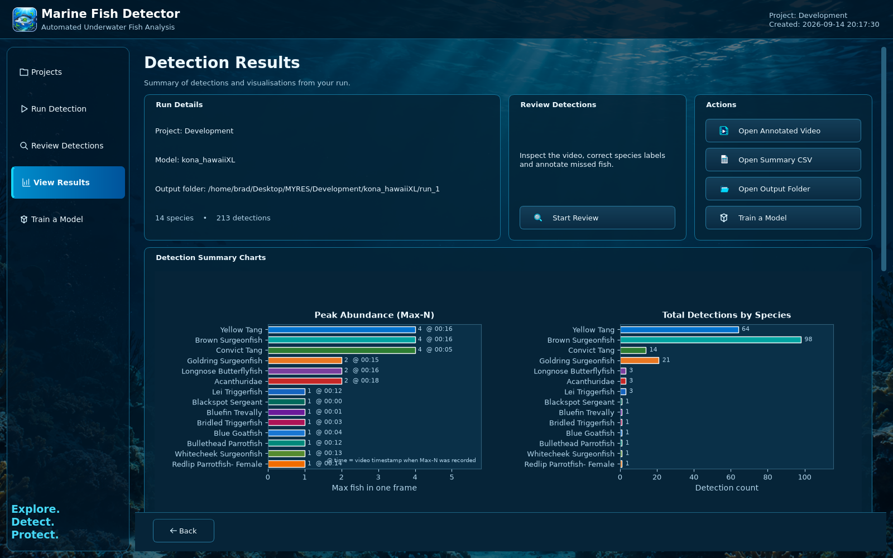
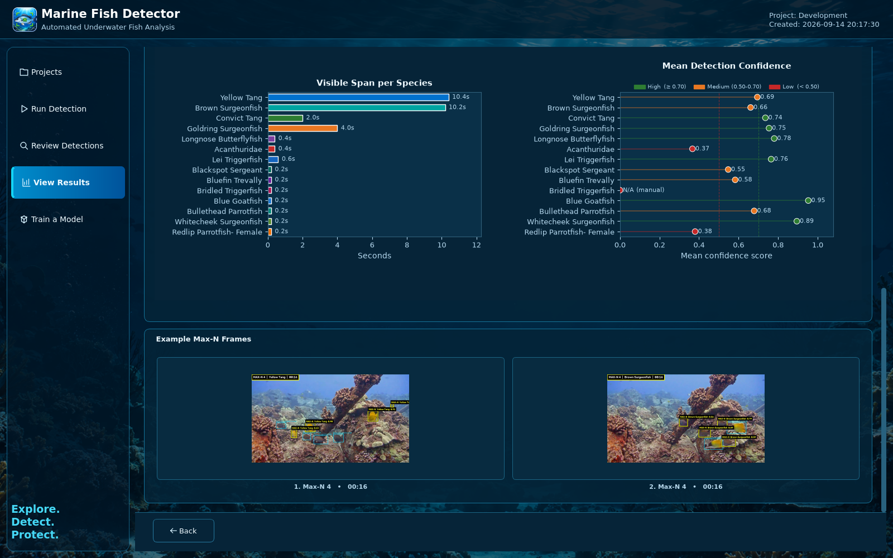
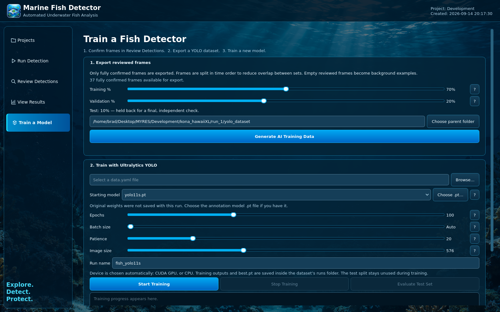

# 🐟 Marine Fish Detection and Classification GUI

A desktop application for automated marine fish detection, classification, tracking, and analysis from underwater video.


---

## Overview 

The Marine Fish Detection and Classification GUI provides an accessible graphical interface for processing underwater video using AI-driven fish detection and classification.

The application lets researchers and marine scientists use AI tools to accelerate underwater marine analysis without requiring programming experience.

Below is an example of AI-annotated underwater imagery positioned next to the ground truth, labelled by a human.

<p align="center">

</p>

Here's a full demo of the application in action:

<p align="center">
<video src="https://github.com/user-attachments/assets/6c2236fa-11d4-4f29-b0e2-a156b227ece0" height="250" controls></video>
</p>

### Features

- Automated fish detection and species classification
- Multi-object tracking
- Max-N abundance estimation by species
- Annotated video output
- Species-level detection summaries
- Low-confidence detection review
- Detection summary histograms and charts
- CSV result exports
- Project-based organisation of detection runs
- Support for additional compatible YOLO model weights (future support for additional AI models)

---

## Quick Start

**Platforms:** Windows, Linux (Ubuntu 24.04), and Apple Silicon macOS (`osx-arm64`, pending real-Mac validation). Intel Macs are not included. Allow approximately **5 GB of free disk space**, plus space for videos and results.

Each platform has a prerequisite block and an application setup block. The setup scripts create the desktop icon automatically; you do not need to paste shortcut code into your terminal.

### Windows

**1. Install Pixi, then use it to install Git and Git LFS.** Open PowerShell:

```powershell
powershell -ExecutionPolicy Bypass -Command "irm -useb https://pixi.sh/install.ps1 | iex"
```

Close and reopen PowerShell, then run:

```powershell
pixi global install git git-lfs
git --version
git lfs version
```

**2. Choose an installation directory, download the app, and create the icon.** Change `$InstallDir` if you prefer another location.

```powershell
$InstallDir = Join-Path $HOME 'MarineApps'
New-Item -ItemType Directory -Force -Path $InstallDir | Out-Null
Set-Location $InstallDir
git clone https://github.com/Brad420169/Marine-Fish-Detection-and-Classification-GUI.git
if ($LASTEXITCODE -ne 0) { throw 'Git clone failed.' }
Set-Location Marine-Fish-Detection-and-Classification-GUI
git lfs install --local
if ($LASTEXITCODE -ne 0) { throw 'Git LFS setup failed.' }
git lfs pull
if ($LASTEXITCODE -ne 0) { throw 'Git LFS download failed.' }
pixi install
if ($LASTEXITCODE -ne 0) { throw 'Pixi installation failed.' }
powershell -NoProfile -ExecutionPolicy Bypass -File .\setup\create_windows_shortcut.ps1
```

The script creates shortcuts on your actual Desktop (including a redirected OneDrive Desktop) and in the Start menu. Execution-policy bypass applies only to that PowerShell process.

### Linux and macOS

- **Linux:** Ubuntu 24.04 is the reference platform. If `curl` is missing, install it with `sudo apt update && sudo apt install -y curl` (or your distribution's package manager).
- **macOS:** use macOS 13 or newer on an Apple Silicon (M-series) Mac with a native ARM64 terminal, not Rosetta. Intel Macs are not configured. Real-Mac validation is still pending. Detection initially uses **CPU**; YOLO training selects **MPS** when available and needs separate testing.

**1. Install Pixi, then use it to install Git and Git LFS.**
Open Terminal:

```bash
curl -fsSL https://pixi.sh/install.sh | bash
```

Close and reopen Terminal, then run:

```bash
pixi global install git git-lfs
git --version
git lfs version
```

These tools are installed globally so Git is available before cloning the repository.

**2. Choose an installation directory, download the app, and create the icon.** Change `INSTALL_DIR` if you prefer another location. The commands automatically select the shortcut script for your operating system. The parentheses keep error handling within this setup block.

```bash
(
    set -e
    INSTALL_DIR="$HOME/MarineApps"
    mkdir -p "$INSTALL_DIR"
    cd "$INSTALL_DIR"
    git clone https://github.com/Brad420169/Marine-Fish-Detection-and-Classification-GUI.git
    cd Marine-Fish-Detection-and-Classification-GUI
    git lfs install --local
    git lfs pull
    pixi install --locked
    case "$(uname -s)" in
        Linux) bash setup/create_linux_shortcut.sh ;;
        Darwin) bash setup/create_macos_shortcut.sh ;;
        *) echo "Unsupported operating system" >&2; exit 1 ;;
    esac
)
```

`--locked` installs the versions recorded in `pixi.lock` without updating it. Pixi selects the dependencies for your operating system automatically.

- **Linux:** the script creates a desktop icon and application-menu entry, including support for localized desktop folder names. If prompted, right-click the icon and choose **Allow Launching**. Some desktop environments display launchers only in the application menu.
- **macOS:** the script creates **Marine Fish Detection GUI.app** on the Desktop with its icon. If macOS blocks the unsigned launcher, right-click it and choose **Open**. The script does not disable Gatekeeper or remove quarantine attributes.

**First Mac test:** start with `pixi run GUI` from the repository so errors remain visible in Terminal. Create a project, load a short video, run each model type you use (YOLO `.pt` and/or RF-DETR `.pth`), review detections, and open results and output files. Separately test YOLO training if needed, then close the app and test the desktop launcher. CPU detection can be slow.

### Launch and pin the app

Double-click **Marine Fish Detection GUI** on your Desktop. Keep the repository in its installation directory: the shortcut points to it. If you move it, rerun the corresponding shortcut script from the new location. You can also rerun just the shortcut script for an existing installation; there is no need to clone again.

- **Windows:** find the app in Start, right-click, and choose **Pin to taskbar** (possibly under **More**).
- **Linux (GNOME/Ubuntu):** open **Show Applications**, right-click **Marine Fish Detection GUI**, and choose **Pin to Dash** or **Add to Favorites**.
- **macOS:** right-click the running app's Dock icon and choose **Options → Keep in Dock**.

## Using the Application

The screenshots below show the current desktop GUI with an existing example project. Your project names, paths, models, and detection counts will differ. Click a screenshot to view it at full size.

### 1. Create or open a project

Start on **Projects**. Click **New Project**, enter a name, choose an output folder, and click **Create**. Detection runs are organised under that project.



The creation dialog asks for both a project name and an output location:



To continue an existing project, select it under **Recent Projects** and click **Open Project**, or use the **Open** button on its card. Use the search, sort, and filter controls on the right to find projects. **View All** expands the recent-project list.

### 2. Select a video and model

Opening a project takes you to **Run Detection**:



1. In **Video Input**, click **Browse…** or drop a video onto the dashed area.
2. In **Model Input**, choose installed model weights. Use **Add model weights…** to import compatible YOLO `.pt` or RF-DETR `.pth` weights.
3. Set the detection and review thresholds:

| Setting | What it changes |
|---|---|
| **Minimum detection confidence** | The minimum score a model detection needs to be accepted. Lower values admit more detections, including potentially more false positives. |
| **Flag for review below** | Accepted detections below this score are flagged for manual review. This does not change which detections the model accepts. |

Use either the sliders or numeric fields. The defaults are **0.25** for detection and **0.50** for review. Hover over a setting for help. Overlap sensitivity is no longer a GUI control; the run configuration uses a fixed IoU threshold of **0.80** where supported by the detector.

### 3. Run detection

Click **Run Detection** at the bottom of the page; scroll down if needed. The progress and status panels show frames processed, processing device, speed, elapsed time, and estimated time remaining. **Cancel** stops the active run.

When processing finishes, the app opens **Review Detections**. Review the predictions before returning to Results. To reopen an existing run without reprocessing its video, click its entry under **Past Runs** on the Run Detection page. A run with saved review edits awaiting a results refresh opens in review first.

## Review Detections

The review page places the video frame in the centre, missed-fish annotations on the left, a selected-fish preview on the right, and the detection table below.



### Inspect and correct predictions

1. Select a detection in the frame or table to inspect its **Zoom / Preview** crop. **Full resolution** opens a larger view.
2. Correct its **Reviewed species** if needed.
3. Use the tick to keep a detection or the cross to reject a false positive or duplicate. Crossed rows are struck out and their boxes disappear; the tick can undo a rejection before saving.
4. Click **Confirm & Next** to save the frame's decisions and advance. Confirm frames that are already correct too.

Resolved rows are hidden from the table. Click their boxes on the image to reopen their species editor. Rejecting a manual annotation deletes it when confirmed; rejecting a model detection records the rejection so refreshed statistics can exclude it.

### Choose which frames to review

**Review frames only** is enabled by default. **Previous**, **Skip**, and **Confirm & Next** then move between flagged frames. Untick it to inspect every frame, including confident predictions and fish the model missed.

Click the frame counter to jump to a frame number. When the original source video is unavailable, review is limited to saved flagged frames and the checkbox is disabled. **Skip** moves on without confirming the frame; navigation prompts before discarding unsaved edits.

### Add missed fish

Drag a box around a missed fish in the main image, then choose its species in the **Annotations** panel. Press **Enter** in its species field to save the annotation without advancing, or save pending boxes together with **Confirm & Next**. Use the annotation's remove button or **Ctrl+Z** to remove a pending box.

For small fish, use **Ctrl+scroll** to zoom, **scroll** to pan vertically, and **Shift+scroll** to pan sideways. Boxes are saved in the original frame coordinates regardless of zoom.

Manual annotations contribute to detection counts and Max-N after the results refresh. They do not invent model confidence scores or track IDs; mean confidence uses model detections only.

### Return to refreshed results

After confirming your edits, click **Back to Results** or navigate away using the sidebar. The app automatically rebuilds results when saved review decisions require it; wait for that refresh to finish. There is no separate **Refresh Results** button in the current GUI.

The refresh rebuilds `track_summary.csv`, charts, and available Max-N examples from the original predictions plus saved decisions. It also writes `reviewed_detections.csv` and preserves the initial summary as `track_summary_original.csv`. Unreviewed predictions retain their original labels. Refreshing does not rerun tracking, and repeated refreshes start from `original_detections.json` rather than accumulating changes.

Older runs without original detection data must be reprocessed before their summaries can be refreshed accurately. Missing source images can prevent individual Max-N examples from being regenerated. The annotated-video button opens the existing output video; the current GUI does not expose a reviewed-video regeneration action.

## Results

Use **View Results** in the sidebar or **Back to Results** after review. The page shows the selected run, species and detection totals, output shortcuts, and summary charts.



### Open outputs

| Action | What it opens |
|---|---|
| **Open Annotated Video** | The generated video with detection boxes, species labels, and confidence scores. |
| **Open Summary CSV** | `track_summary.csv`, with species-level Max-N, timing, visible duration, track counts, detection counts, and mean confidence. |
| **Open Output Folder** | The run directory containing its generated files. |
| **Start Review** | The review page for this run. |
| **Train a Model** | Dataset export and YOLO training from confirmed review frames. |

The run directory also contains `low_confidence_review.csv` for flagged detections and saved review decisions. Output buttons are disabled when the corresponding file is unavailable.

### Charts and Max-N examples

Scroll down to see peak abundance (**Max-N**), total detections, visible span, and mean detection confidence by species. Max-N is the largest number of fish of a species visible in a single frame, rather than a count of unique fish across the whole video.



The example frames show available Max-N observations with the relevant fish highlighted. After review, the refreshed charts and examples reflect saved corrections and manual annotations.

## Train a Model

Open **Train a Model** from Results or the sidebar after loading a run.



1. Fully review and confirm the frames you want to use. Inspect all predictions and add missed fish before confirming; empty confirmed frames become background examples.
2. Under **Export reviewed frames**, choose training and validation percentages. The remaining percentage is held out for testing. Frames are split in time order to reduce overlap between sets.
3. Choose a destination and click **Generate AI Training Data**.
4. Under **Train with Ultralytics YOLO**, select the generated `data.yaml` and a starting YOLO `.pt` model. RF-DETR `.pth` weights cannot be trained with this trainer.
5. Set epochs, batch size, patience, image size, and run name, then click **Start Training**. Scroll down to follow the log or use **Stop Training** if needed.
6. After training succeeds, use **Evaluate Test Set** for the held-out test frames. This is separate from inspecting predictions in Review Detections.

Training saves new weights, including `best.pt`, under the dataset's `runs` folder. Add the resulting weights through **Add model weights…** on Run Detection to use them for another video.

## Updating

To update the application, open PowerShell in the application folder and run:

```powershell
git pull
git lfs pull
pixi install
```

## Project Structure

```text
Marine-Fish-Detection-and-Classification-GUI/
│
├── assets/             Application icons and graphics
├── models/             Marine fish detection model weights
├── scripts/            Application source code
│
├── launch_gui.bat      Windows launcher
├── pixi.toml           Environment configuration
├── pixi.lock           Locked dependency environment
├── .gitattributes      Git LFS configuration
├── .gitignore          Local/generated file exclusions
├── LICENSE             Software license
└── README.md
```

Application environments and user-created project information are generated locally and are not stored in the repository.

Detection outputs are stored in the location the user selects when creating a project.

## Adding a New AI Object/Fish Detector Model

Detection logic is isolated in `scripts/detectors.py` behind a single adapter interface, so `pipeline.py` and the GUI can remain agnostic to the model architecture. 
Adding a new model type (e.g. a different YOLO variant, DETR variant, or something else entirely) means implementing an additional Python class to support the new model type — nothing else in the codebase needs to change.

### How the adapter layer works

Every detector is a subclass of `BaseDetector` with one required method:

```python
class BaseDetector:
    kind: str = "base"

    def infer(self, frame_bgr: np.ndarray, conf: float, iou: float) -> DetectionFrame:
        raise NotImplementedError
```

`infer()` takes a single BGR video frame plus the confidence/IoU thresholds from the GUI sliders, and must return a `DetectionFrame`:

```python
@dataclass
class DetectionFrame:
    annotated: np.ndarray                       # frame with boxes/labels drawn on it
    species: list[str] = field(default_factory=list)
    confidences: list[float] = field(default_factory=list)
    xyxy: list[list[float]] = field(default_factory=list)       # [x1, y1, x2, y2] per detection
    track_ids: list[int | None] = field(default_factory=list)   # None if no tracker
```

As long as your class returns a correctly shaped `DetectionFrame`, everything downstream, such as the annotated output video, `track_summary.csv`, `low_confidence_review.csv`, the Max-N example frames, and the Results page charts, will work automatically.

### Steps to add a new model

1. **Write a new class in `detectors.py`** that subclasses `BaseDetector`:

```python
   class MyModelDetector(BaseDetector):
       kind = "mymodel"

       def __init__(self, weights_path: Path, device: str | None) -> None:
           # Load your model here, once, at startup.
           from my_model_lib import MyModel
           self.model = MyModel.load(str(weights_path), device=device)

       def infer(self, frame_bgr: np.ndarray, conf: float, iou: float) -> DetectionFrame:
           # Run inference, then map your model's output into the
           # DetectionFrame fields above. Draw boxes/labels onto a
           # copy of frame_bgr for the `annotated` field.
           ...
           return DetectionFrame(
               annotated=annotated,
               species=species,
               confidences=confidences,
               xyxy=xyxy,
               track_ids=track_ids,
           )
```

   Look at `YOLODetector` and `RFDETRDetector` in the same file as worked examples. Note how `RFDETRDetector` handles a model with no built-in tracker by attaching `supervision.ByteTrack()` manually. If your model doesn't track objects across frames either, do the same.

2. **Register the weights file extension** in the `load_detector()` factory at the bottom of `detectors.py`:

```python
   def load_detector(weights_path: Path, device: str | None) -> BaseDetector:
       suffix = weights_path.suffix.lower()
       if suffix == ".pt":
           return YOLODetector(weights_path, device=device)
       if suffix == ".pth":
           return RFDETRDetector(weights_path, device=device)
       if suffix == ".your_extension":
           return MyModelDetector(weights_path, device=device)
       raise ValueError(...)
```

   The GUI's model dropdown (`WeightsRow` in `widgets.py`) currently only globs for `*.pt` and `*.pth` files in `models/` — if your weights use a different extension, add it to the glob there too:

```python
   models = sorted(
       [*self.models_dir.glob("*.pt"), *self.models_dir.glob("*.pth"), *self.models_dir.glob("*.your_extension")]
   )
```

3. **Add any new dependencies** to `pixi.toml`, then run `pixi install` to lock them into `pixi.lock`.

4. **Drop your weights file into `models/`** (or use the "Add model weights…" button in the GUI) and select it from the Weights dropdown — the rest of the pipeline (detection loop, CSV export, Max-N frame extraction, summary charts) runs unmodified.

### Detection is slow

Processing speed depends heavily on the available hardware.

A compatible GPU can significantly improve detection performance. Systems without a compatible GPU can use CPU processing, but processing will generally be slower.

The Windows/Linux environment includes CUDA-enabled PyTorch 2.7.1 with CUDA 12.6, including support for Pascal GPUs such as the GTX 1070. A working NVIDIA driver is required. Before each run, the app checks CUDA availability and executes a small GPU operation, then explicitly passes the selected device to inference. The processing status and log show the selected GPU or the reason for CPU fallback. GPU errors during model inference are reported rather than silently restarting on the CPU.

---

## Troubleshooting

 
### `git` is not recognised / not found
**Windows & Linux** Close and reopen the terminal. If the problem continues, confirm it is installed with `git --version`.
 
### `pixi` is not recognised / not found
Close and reopen PowerShell/Terminal, then check:
```
pixi --version
```
**Linux:** if it still isn't found, `pixi` may not be on your `PATH` for non-login shells. Run `which pixi` to find its location, then use that full path when running `pixi` commands (or add it to `~/.bashrc`).
 
### Model files did not download
Open PowerShell/Terminal in the application folder and run:
```
git lfs install
git lfs pull
```
 
### The application does not launch
Open PowerShell/Terminal in the application folder and run:
```
pixi install
pixi run GUI
```
Any startup errors will then be displayed in the terminal.
 
**Linux only:** if the desktop shortcut does not launch, rerun its setup script from the repository, then right-click the icon and choose **Allow Launching**:

```bash
bash setup/create_linux_shortcut.sh
```


## Development

The application is written in Python and uses:

- PyQt6
- Ultralytics YOLO
- PyTorch
- OpenCV
- Matplotlib
- NumPy

Pixi manages the development and runtime environment.

### Planned Features

Future development may include:

- Expanded model management
- Improved detection review and correction tools
- Additional result visualisation and analysis options

---


## Model and Dataset Attribution

The included marine fish detection models were trained using the **Kona, Hawaii Dataset**, published by ReefOSHawaii on Roboflow Universe.

**Dataset citation:**

> ReefOSHawaii. (2022). *Kona, Hawaii Dataset*. Roboflow Universe.

[Kona, Hawaii Dataset — Roboflow Universe](https://universe.roboflow.com/reefoshawaii/kona-hawaii)

The dataset is licensed under the **Creative Commons Attribution 4.0 International (CC BY 4.0) License**.

[Creative Commons Attribution 4.0 International](https://creativecommons.org/licenses/by/4.0/)

The model weights included in this repository were trained by the author of this project using the Kona, Hawaii Dataset. They are not original model weights supplied by ReefOSHawaii or Roboflow.

---

## License

The application source code is licensed under the **MIT License**. See [`LICENSE`](LICENSE) for details.

The included model weights were trained using the Kona, Hawaii Dataset described above. The underlying training dataset is provided by ReefOSHawaii under the **Creative Commons Attribution 4.0 International (CC BY 4.0) License**.
