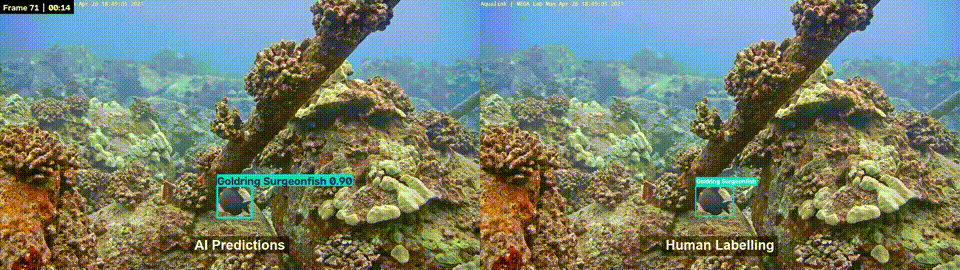
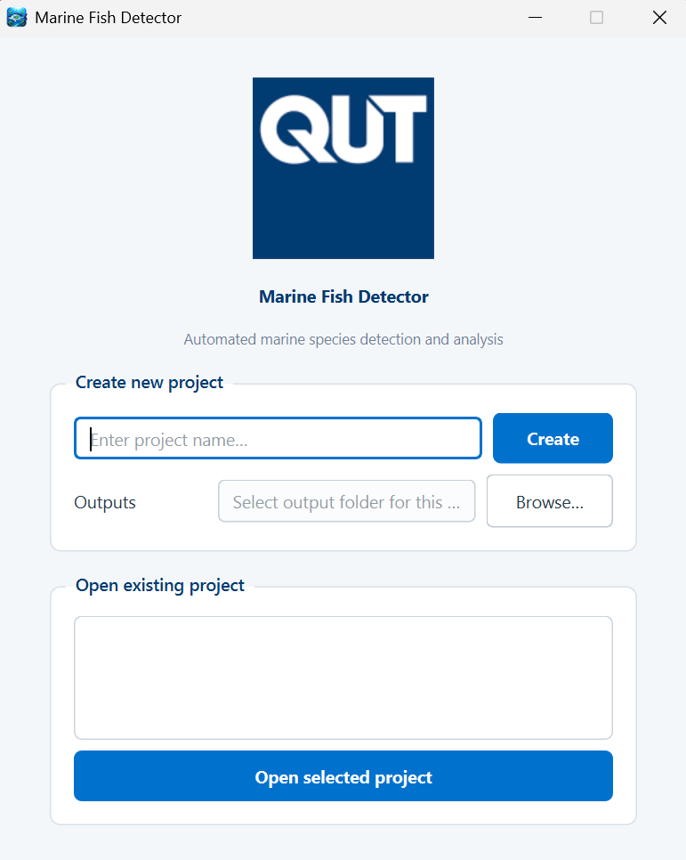
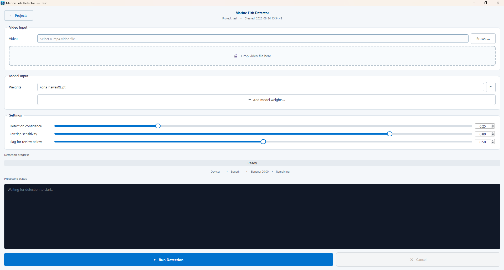
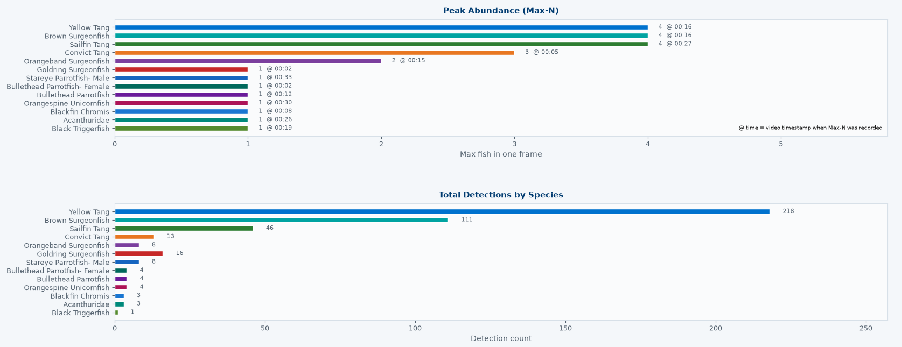

# 🐟 Marine Fish Detection and Classification GUI

A desktop application for automated marine fish detection, classification, tracking, and analysis from underwater video.


---

## Overview 

The Marine Fish Detection and Classification GUI provides an accessible graphical interface for processing underwater video using AI-driven fish detection and classification.

The application lets researchers and marine scientists use AI tools to accelerate underwater marine analysis without requiring programming experience.

Below is an example of AI-annotated underwater imagery positioned next to the ground truth, labelled by a human.

<p align="center">

</p>

Here's a full demo of the application in action:

<p align="center">
<video src="https://github.com/user-attachments/assets/6c2236fa-11d4-4f29-b0e2-a156b227ece0" height="250" controls></video>
</p>

### Features

- Automated fish detection and species classification
- Multi-object tracking
- Max-N abundance estimation by species
- Annotated video output
- Species-level detection summaries
- Low-confidence detection review
- Detection summary histograms and charts
- CSV result exports
- Project-based organisation of detection runs
- Support for additional compatible YOLO model weights (future support for additional AI models)

---

## Quick Start

**Platforms:** Windows, Linux (Ubuntu 24.04), and Apple Silicon macOS (`osx-arm64`, pending real-Mac validation). Intel Macs are not included. Allow approximately **5 GB of free disk space**, plus space for videos and results.

Each platform has a prerequisite block and an application setup block. The setup scripts create the desktop icon automatically; you do not need to paste shortcut code into your terminal.

### Windows

**1. Install Pixi, then use it to install Git and Git LFS.** Open PowerShell:

```powershell
powershell -ExecutionPolicy Bypass -Command "irm -useb https://pixi.sh/install.ps1 | iex"
```

Close and reopen PowerShell, then run:

```powershell
pixi global install git git-lfs
git --version
git lfs version
```

**2. Choose an installation directory, download the app, and create the icon.** Change `$InstallDir` if you prefer another location.

```powershell
$InstallDir = Join-Path $HOME 'MarineApps'
New-Item -ItemType Directory -Force -Path $InstallDir | Out-Null
Set-Location $InstallDir
git clone https://github.com/Brad420169/Marine-Fish-Detection-and-Classification-GUI.git
if ($LASTEXITCODE -ne 0) { throw 'Git clone failed.' }
Set-Location Marine-Fish-Detection-and-Classification-GUI
git lfs install --local
if ($LASTEXITCODE -ne 0) { throw 'Git LFS setup failed.' }
git lfs pull
if ($LASTEXITCODE -ne 0) { throw 'Git LFS download failed.' }
pixi install
if ($LASTEXITCODE -ne 0) { throw 'Pixi installation failed.' }
powershell -NoProfile -ExecutionPolicy Bypass -File .\setup\create_windows_shortcut.ps1
```

The script creates shortcuts on your actual Desktop (including a redirected OneDrive Desktop) and in the Start menu. Execution-policy bypass applies only to that PowerShell process.

### Linux (Ubuntu/Debian)

**1. Install Pixi, then use it to install Git and Git LFS.** Open Terminal. If `curl` is missing, install it with `sudo apt update && sudo apt install -y curl` (or your distribution's package manager).

```bash
curl -fsSL https://pixi.sh/install.sh | bash
```

Close and reopen Terminal, then run:

```bash
pixi global install git git-lfs
git --version
git lfs version
```

**2. Choose an installation directory, download the app, and create the icon.** Change the first path if you prefer another location. The parentheses keep error handling within this setup block.

```bash
(
    set -e
    INSTALL_DIR="$HOME/MarineApps"
    mkdir -p "$INSTALL_DIR"
    cd "$INSTALL_DIR"
    git clone https://github.com/Brad420169/Marine-Fish-Detection-and-Classification-GUI.git
    cd Marine-Fish-Detection-and-Classification-GUI
    git lfs install --local
    git lfs pull
    pixi install
    bash setup/create_linux_shortcut.sh
)
```

The script creates the desktop icon and application-menu entry. It supports desktop folders with localized names. If your desktop asks, right-click the icon and choose **Allow Launching**. Some Linux desktop environments display launchers only in the application menu.

### macOS (Apple Silicon; pending real-Mac validation)

Use macOS 13 or newer and a native ARM64 terminal on an M-series Mac, not a terminal running under Rosetta. The environment includes macOS PyTorch wheels; detection initially runs on **CPU**. YOLO training already selects Apple's **MPS** GPU backend when available, but that path still needs testing on a Mac. Intel Macs (`osx-64`) are not configured.

**1. Install Pixi, then use it to install Git and Git LFS.** Homebrew is not required. Open Terminal:

```bash
curl -fsSL https://pixi.sh/install.sh | bash
```

Close and reopen Terminal, then run:

```bash
pixi global install git git-lfs
git --version
git lfs version
```

These tools are installed globally so Git is available before cloning the repository.

**2. Download the app, install the environment, and create the desktop app.**

```bash
(
    set -e
    INSTALL_DIR="$HOME/MarineApps"
    mkdir -p "$INSTALL_DIR"
    cd "$INSTALL_DIR"
    git clone https://github.com/Brad420169/Marine-Fish-Detection-and-Classification-GUI.git
    cd Marine-Fish-Detection-and-Classification-GUI
    git lfs install --local
    git lfs pull
    pixi install --locked
    bash setup/create_macos_shortcut.sh
)
```

The script creates **Marine Fish Detection GUI.app** on the Desktop, including its icon. If macOS blocks the unsigned launcher, right-click it and choose **Open**. The script does not disable Gatekeeper or remove quarantine attributes.

**First Mac test:** start with `pixi run GUI` from the repository so errors remain visible in Terminal. Create a project, load a short video, run each model type you use (YOLO `.pt` and/or RF-DETR `.pth`), review detections, and open results and output files. Separately test YOLO training if needed, then close the app and test the desktop launcher. CPU detection can be slow.

### Launch and pin the app

Double-click **Marine Fish Detection GUI** on your Desktop. Keep the repository in its installation directory: the shortcut points to it. If you move it, rerun the corresponding shortcut script from the new location. You can also rerun just the shortcut script for an existing installation; there is no need to clone again.

- **Windows:** find the app in Start, right-click, and choose **Pin to taskbar** (possibly under **More**).
- **Linux (GNOME/Ubuntu):** open **Show Applications**, right-click **Marine Fish Detection GUI**, and choose **Pin to Dash** or **Add to Favorites**.
- **macOS:** right-click the running app's Dock icon and choose **Options → Keep in Dock**.

## Using the Application

### 1. Create a Project


When the application opens:

1. Enter a project name.
2. Select where you want detection results to be stored.
3. Click **Create**.

<p align="left">

</p>

Your detection runs will be organised under this project.

### 2. Select a Video

Select a video using the **Video Input** section or drag and drop a video directly into the application.

### 3. Select a Model

Choose a marine fish detection model from the **Model Input** section.

The application includes default detection models.

You can add additional YOLO & RF-DETR model weights using **Add model weights**.

### 4. Configure Detection Settings

The following parameters can be adjusted before running detection:

| Setting | Description |
|---|---|
| **Detection confidence** | Minimum confidence required for a detection to be accepted |
| **Overlap sensitivity** | Controls how overlapping detection boxes are handled (Higher values can capture closely bundled fish more accurately, at the cost of occasional double/triple detections)|
| **Flag for review below** | Accepted detections below this confidence are flagged for manual review |

Change values using either the slider or the numeric field.

Hover over a parameter name in the application for additional information.

The default values provide a reasonable starting point.

### 5. Run Detection

Click **▶ Run Detection**.

While the video is being processed, the application displays:

- Detection progress
- Frames processed
- Processing speed
- Elapsed time
- Estimated time remaining
- Processing device

The **Results** page opens automatically when processing is complete.

<p align="center">

</p>

---

## Results

The Results page provides a summary of the completed detection run and access to its generated outputs.

### Annotated Video

The annotated video contains detected fish with:

- Bounding boxes
- Species classifications
- Confidence scores
- Frame numbers
- Video timestamps

You can open the video directly from the Results page.

### Detection Summary

The application generates:

**`track_summary.csv`**

This contains species-level information including:

- Species
- Max-N
- Max-N timestamp
- First and last observation
- Visible duration
- Unique tracks (generated by AI tracker BotSort/ByteTrack)
- Total detections
- Mean detection confidence

### Low-Confidence Review

The application generates:

**`low_confidence_review.csv`**

This contains accepted detections below the selected review threshold, so you can identify uncertain detections for manual inspection.

### Max-N Example Frames

Example frames are saved for reported Max-N observations, with the relevant detections highlighted.

These can be used to visually inspect the fish contributing to the Max-N estimate.

### Summary Charts

The Results page includes charts showing:

- Peak abundance (Max-N)
- Total detections
- Visible duration
- Mean detection confidence

<p align="center">

</p>

Results can also be exported as a summary figure.

### Past Runs

You can reopen previous detection runs from the **Past Runs** section without reprocessing the video.

---
## Review Step - Correct AI Predictions and Missed Detections

### Refreshing results after review

After saving decisions with **Confirm & Next**, click **Refresh Results** on the
review page. The application rebuilds `track_summary.csv`, the Results charts,
and available Max-N examples from the original per-frame detections plus saved
review decisions. It also writes `reviewed_detections.csv`, containing all
remaining detections, and preserves the initial summary as
`track_summary_original.csv`.

Each row in the detection table has a **✓** and a **✕** in its Decision column.
The tick is set by default, so a frame that looks right can be accepted as a
whole with **Confirm & Next**; correct a species first and the tick keeps it.
The cross drops the detection: a model detection is recorded as rejected and
removed from the refreshed statistics, while a manual annotation is deleted from
the review CSV outright. Crossed rows are struck out and their boxes disappear
from the frame straight away, but nothing is written until **Confirm & Next**,
so a cross can be undone with the tick.

Confirmed species corrections replace the original label. Detections on frames
you have not reviewed yet retain their original prediction. Confidence values
remain the model's scores;
reviewing does not rerun tracking or create new track IDs. Refreshing repeatedly
is safe: each refresh starts from `original_detections.json`, not the previously
refreshed summary.

Older runs without `original_detections.json` must be rerun before their summaries
can be refreshed accurately. If source images are unavailable, missing Max-N
examples are omitted rather than showing stale examples. Video regeneration is a
separate action using **Regenerate reviewed video**.

### Reviewing flagged frames or the whole video

The review page can work through flagged frames only or through every frame of
the video, controlled by the **Review frames only** tick box (on by default):

- **Ticked** — **Previous**, **Skip**, **Confirm & Next** and the left/right
  arrow keys move between flagged frames, so you only see detections the model
  was unsure about.
- **Unticked** — the same controls step one video frame at a time, so you can
  work through footage the model was confident about, or missed entirely.

Either way the counter reads the absolute position in the video, for example
`Frame 412 / 9000`, followed by the timestamp and how many flagged frames have
been reviewed. Click it to jump straight to any frame number. Frames are read
from the original source video, so unflagged frames are available without
rerunning detection. If the source video cannot be found, only flagged frames
can be reviewed and the tick box is disabled.

### Adding missed fish during review

Drag a box directly on the frame around any fish the model missed. Each box
appears in the **Annotations** panel on the left, where you choose its species
or **Remove** it, and is shown enlarged on the right just like a flagged
detection, so you can check what you have boxed. A plain click without dragging
still selects a detection instead.

Pressing **Enter** in a box's species field saves it straight away: the box
leaves the Annotations panel and appears in the detection table below as a
confirmed manual annotation, without moving off the frame, so several missed
fish can be boxed and named one after another. Boxes you leave in the panel are
saved with the rest of the frame's decisions when you click **Confirm & Next**
instead; leaving the frame first prompts before discarding them.

Small or distant fish are easier to box accurately zoomed in. **Ctrl+scroll** on
the frame zooms about the mouse pointer, up to 12×, keeping whatever is under the
pointer in place; the current level is shown next to the frame counter. Once
zoomed, **scroll** pans up and down and **Shift+scroll** pans sideways, and
Ctrl+scrolling back out returns to the whole frame. Zoom only changes what you
see: boxes are always recorded in full-resolution frame coordinates, and the
level is kept as you move between frames so you can watch one area across the
video.

Manual rows have `annotation_source=manual` and a stable `annotation_id`. Their
confidence and track ID are blank: manual fish increase detection counts and
Max-N after **Refresh Results**, but do not invent tracks or model confidence.
Mean confidence uses model detections only; species with only manual annotations
show no model confidence. **Regenerate reviewed video** includes saved manual
boxes. To remove a saved manual annotation, cross it out and confirm the frame.

Annotating a frame that was not flagged saves that frame's image and detection
context alongside the flagged ones, so it joins the review CSV and is rebuilt
correctly by **Refresh Results** and **Regenerate reviewed video**.


Regenerating a reviewed video now **replaces the annotated output video** at its
existing path, so the Results page opens the updated version. The first original
annotated video is retained under `.original_video/` in the run folder. Every
regeneration starts from that backup and the saved review decisions. The baseline is retained internally for repeatable regeneration; there is no restore action in the GUI. The source input video is
never modified. A failed regeneration leaves the current output video intact.

### Evaluate the AI model

Click **Evaluate AI model** beside **Open video** on the Review page. The three headline scores separate finding fish from identifying them:

- **Detection precision:** detected fish divided by all predictions, regardless of species. Rejected or duplicate predictions reduce precision; species corrections do not.
- **Detection recall:** detected fish from trained species divided by all reviewed fish from trained species. A recall of 0.91 means 9% of those fish were not detected. A detected fish still counts if its species was corrected.
- **Species accuracy:** correct species labels divided by detected fish from trained species. Missed fish are excluded, so this measures identification after detection.

Species outside the saved model class list are reported separately as detected or missed. They are excluded from trained-species recall and accuracy, but a detected fish still counts toward detection precision. The detailed trained-species table retains species-aware precision/recall: an incorrect trained label remains a false positive even when the actual fish is outside the class list. New runs preserve the class list with their original predictions; older runs use `species_names.json`. If neither supplies a class list, recall and species accuracy show **N/A** rather than guessing from observed predictions. Review labels must match the saved class names to be considered trained species.

**Confirm & Next** records full-frame completion, including empty frames and unchanged confident predictions. Inspect every prediction, reject spurious or duplicate boxes, and add every missed fish before confirming. Turn off **Review frames only** to review the whole video. Partial reviews show provisional scores for their subset, not a full-video estimate. Older saved review images can establish provisional review coverage; reconfirm those frames to verify completion. Runs without original detections must be processed again before evaluation is available.

Completion is stored in `review_completion.json` and tied to the original predictions and saved decisions. Later saved edits invalidate that frame's completion until it is reconfirmed. Evaluation does not change predictions or summary results. Counts are fish observations per frame, not unique fish; these are review-based precision/recall scores, not IoU or mAP measurements. Undefined scores display **N/A**.

## Updating

To update the application, open PowerShell in the application folder and run:

```powershell
git pull
git lfs pull
pixi install
```

## Project Structure

```text
Marine-Fish-Detection-and-Classification-GUI/
│
├── assets/             Application icons and graphics
├── models/             Marine fish detection model weights
├── scripts/            Application source code
│
├── launch_gui.bat      Windows launcher
├── pixi.toml           Environment configuration
├── pixi.lock           Locked dependency environment
├── .gitattributes      Git LFS configuration
├── .gitignore          Local/generated file exclusions
├── LICENSE             Software license
└── README.md
```

Application environments and user-created project information are generated locally and are not stored in the repository.

Detection outputs are stored in the location the user selects when creating a project.

## Adding a New AI Object/Fish Detector Model

Detection logic is isolated in `scripts/detectors.py` behind a single adapter interface, so `pipeline.py` and the GUI can remain agnostic to the model architecture. 
Adding a new model type (e.g. a different YOLO variant, DETR variant, or something else entirely) means implementing an additional Python class to support the new model type — nothing else in the codebase needs to change.

### How the adapter layer works

Every detector is a subclass of `BaseDetector` with one required method:

```python
class BaseDetector:
    kind: str = "base"

    def infer(self, frame_bgr: np.ndarray, conf: float, iou: float) -> DetectionFrame:
        raise NotImplementedError
```

`infer()` takes a single BGR video frame plus the confidence/IoU thresholds from the GUI sliders, and must return a `DetectionFrame`:

```python
@dataclass
class DetectionFrame:
    annotated: np.ndarray                       # frame with boxes/labels drawn on it
    species: list[str] = field(default_factory=list)
    confidences: list[float] = field(default_factory=list)
    xyxy: list[list[float]] = field(default_factory=list)       # [x1, y1, x2, y2] per detection
    track_ids: list[int | None] = field(default_factory=list)   # None if no tracker
```

As long as your class returns a correctly shaped `DetectionFrame`, everything downstream, such as the annotated output video, `track_summary.csv`, `low_confidence_review.csv`, the Max-N example frames, and the Results page charts, will work automatically.

### Steps to add a new model

1. **Write a new class in `detectors.py`** that subclasses `BaseDetector`:

```python
   class MyModelDetector(BaseDetector):
       kind = "mymodel"

       def __init__(self, weights_path: Path, device: str | None) -> None:
           # Load your model here, once, at startup.
           from my_model_lib import MyModel
           self.model = MyModel.load(str(weights_path), device=device)

       def infer(self, frame_bgr: np.ndarray, conf: float, iou: float) -> DetectionFrame:
           # Run inference, then map your model's output into the
           # DetectionFrame fields above. Draw boxes/labels onto a
           # copy of frame_bgr for the `annotated` field.
           ...
           return DetectionFrame(
               annotated=annotated,
               species=species,
               confidences=confidences,
               xyxy=xyxy,
               track_ids=track_ids,
           )
```

   Look at `YOLODetector` and `RFDETRDetector` in the same file as worked examples. Note how `RFDETRDetector` handles a model with no built-in tracker by attaching `supervision.ByteTrack()` manually. If your model doesn't track objects across frames either, do the same.

2. **Register the weights file extension** in the `load_detector()` factory at the bottom of `detectors.py`:

```python
   def load_detector(weights_path: Path, device: str | None) -> BaseDetector:
       suffix = weights_path.suffix.lower()
       if suffix == ".pt":
           return YOLODetector(weights_path, device=device)
       if suffix == ".pth":
           return RFDETRDetector(weights_path, device=device)
       if suffix == ".your_extension":
           return MyModelDetector(weights_path, device=device)
       raise ValueError(...)
```

   The GUI's model dropdown (`WeightsRow` in `widgets.py`) currently only globs for `*.pt` and `*.pth` files in `models/` — if your weights use a different extension, add it to the glob there too:

```python
   models = sorted(
       [*self.models_dir.glob("*.pt"), *self.models_dir.glob("*.pth"), *self.models_dir.glob("*.your_extension")]
   )
```

3. **Add any new dependencies** to `pixi.toml`, then run `pixi install` to lock them into `pixi.lock`.

4. **Drop your weights file into `models/`** (or use the "Add model weights…" button in the GUI) and select it from the Weights dropdown — the rest of the pipeline (detection loop, CSV export, Max-N frame extraction, summary charts) runs unmodified.

### Detection is slow

Processing speed depends heavily on the available hardware.

A compatible GPU can significantly improve detection performance. Systems without a compatible GPU can use CPU processing, but processing will generally be slower.

The Windows/Linux environment includes CUDA-enabled PyTorch 2.7.1 with CUDA 12.6, including support for Pascal GPUs such as the GTX 1070. A working NVIDIA driver is required. Before each run, the app checks CUDA availability and executes a small GPU operation, then explicitly passes the selected device to inference. The processing status and log show the selected GPU or the reason for CPU fallback. GPU errors during model inference are reported rather than silently restarting on the CPU.

---

## Troubleshooting

 
### `git` is not recognised / not found
**Windows & Linux** Close and reopen the terminal. If the problem continues, confirm it is installed with `git --version`.
 
### `pixi` is not recognised / not found
Close and reopen PowerShell/Terminal, then check:
```
pixi --version
```
**Linux:** if it still isn't found, `pixi` may not be on your `PATH` for non-login shells. Run `which pixi` to find its location, then use that full path when running `pixi` commands (or add it to `~/.bashrc`).
 
### Model files did not download
Open PowerShell/Terminal in the application folder and run:
```
git lfs install
git lfs pull
```
 
### The application does not launch
Open PowerShell/Terminal in the application folder and run:
```
pixi install
pixi run GUI
```
Any startup errors will then be displayed in the terminal.
 
**Linux only:** if the desktop shortcut does not launch, rerun its setup script from the repository, then right-click the icon and choose **Allow Launching**:

```bash
bash setup/create_linux_shortcut.sh
```


## Development

The application is written in Python and uses:

- PyQt6
- Ultralytics YOLO
- PyTorch
- OpenCV
- Matplotlib
- NumPy

Pixi manages the development and runtime environment.

### Planned Features

Future development may include:

- Expanded model management
- Improved detection review and correction tools
- Additional result visualisation and analysis options

---


## Model and Dataset Attribution

The included marine fish detection models were trained using the **Kona, Hawaii Dataset**, published by ReefOSHawaii on Roboflow Universe.

**Dataset citation:**

> ReefOSHawaii. (2022). *Kona, Hawaii Dataset*. Roboflow Universe.

[Kona, Hawaii Dataset — Roboflow Universe](https://universe.roboflow.com/reefoshawaii/kona-hawaii)

The dataset is licensed under the **Creative Commons Attribution 4.0 International (CC BY 4.0) License**.

[Creative Commons Attribution 4.0 International](https://creativecommons.org/licenses/by/4.0/)

The model weights included in this repository were trained by the author of this project using the Kona, Hawaii Dataset. They are not original model weights supplied by ReefOSHawaii or Roboflow.

---

## License

The application source code is licensed under the **MIT License**. See [`LICENSE`](LICENSE) for details.

The included model weights were trained using the Kona, Hawaii Dataset described above. The underlying training dataset is provided by ReefOSHawaii under the **Creative Commons Attribution 4.0 International (CC BY 4.0) License**.
